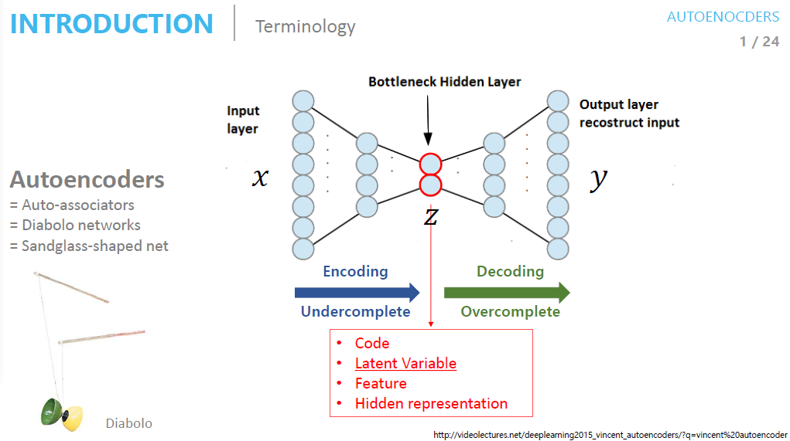
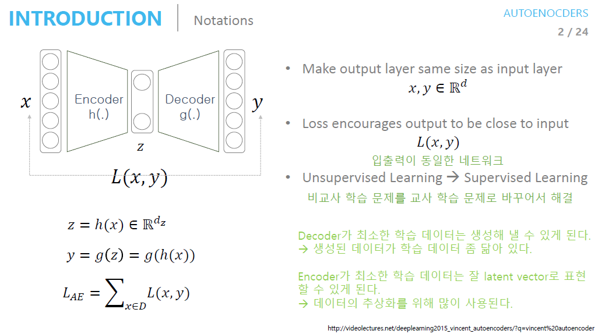
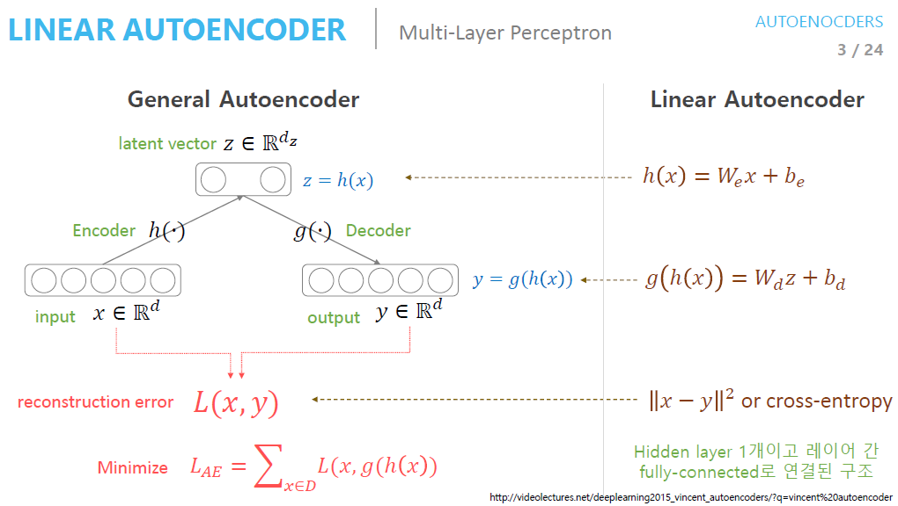
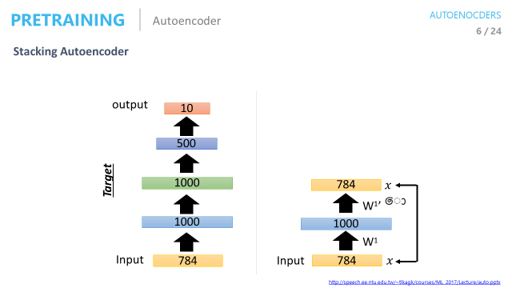
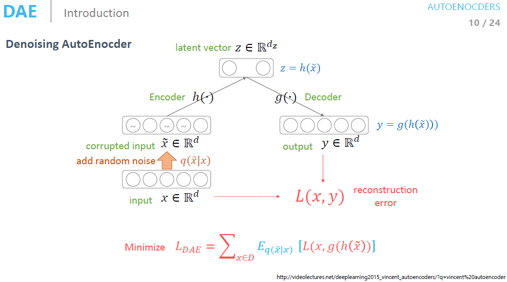
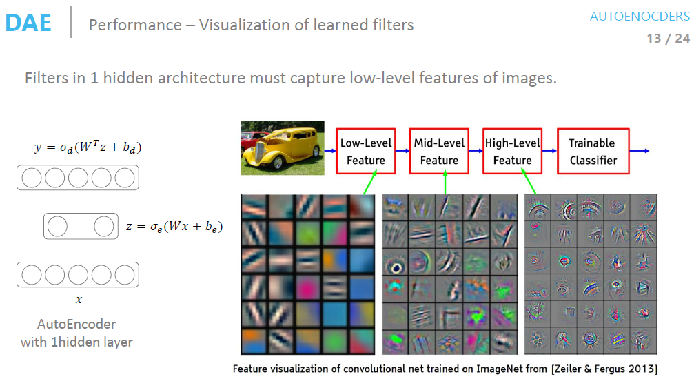
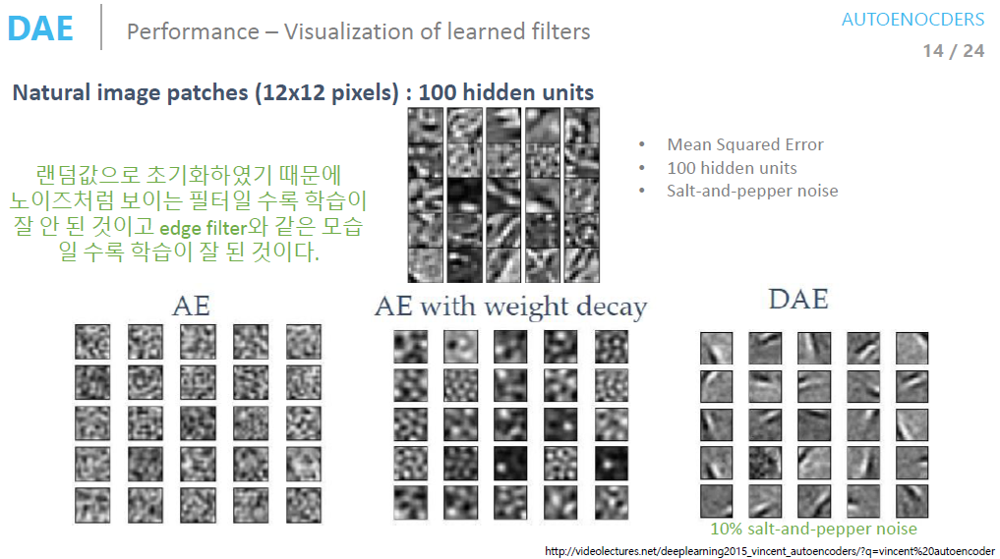

# Autoencoders

- Autoencoder는 입력과 출력의 차원이 같은 구조
- 일반적으론 가운데 차원이 줄어드는 형태

- Loss Function $L(x, y)$로 구성
    - 입출력이 동일한 네트워크여서 Loss Function은 입력값과 출력값이 얼마나 유사한지 비교함
        - Unsupervised Learning을 Supervised Learning으로 대체해 문제를 풂
        - Self Learning이라고도 함

- Encoder는 데이터를 압축하므로 학습에 사용한 데이터와 유사
- Decoder는 생성된 데이터가 학습 데이터와 닮음
    - 장점
        - 최소한의 성능 보장
    - 단점
        - 새로운 데이터이기 보단 기존의 데이터와 유사

일반적인 AutoEncoder의 모습
- input이 들어와 은닉층을 거쳐 Encoding과 Decoding후 ouput 출력
- 입력과 출력이 같기를 바라므로 Loss Fuction을 Reconstruction Error라 부름

Linear AutoEncoder의 모습
- input이 들어와 은닉층을 거쳐 Encoding과 Decoding후 ouput 출력
    - 이떄 Activation Function을 거치지 않음
- PCA와 basis는 다르지만 동일한 Manifold를 찾음

AutoEncoder의 역할
- 차원 축소
- Network parameter 초기화, pre-training에 사용
    - 그 당시 Xavier Initialization, Batch-Norm이 존재하지 않아 대용으로 사용

## Stacking AutoEncoder
Stacking AutoEncoder
- AutoEncoder를 쌓아 올려 pre-training 진행하는 AE

AE를 이용한 Initialize 방법

- layer by layer로 weight를 초기화
    - `784`차원에서 `1000`차원으로 가는 weight를 만듦
    - 다시 이전 차원으로 돌아왔을 때 원복이 가능한 weight로 초기화
    - 위의 과정을 마지막 layer까지 반복

- 학습이 끝나면 데이터를 넣어 BackPropagation 진행

## Denoising AutoEncoder
Denoising AutoEncoder
- Noise를 추가한 입력값을 넣어 Noise가 없는 결과값을 내는 AE
- Noise의 정도는 같은 이미지인지를 인식할 수 있을 정도
    - Manifold 상에는 동일하지만 원본 데이터랑은 다른 이미지를 만듦

- 입력값에 Random Noise를 추가하여 AutoEnocder를 학습
- 입력값과 출력값을 갖고 Loss Function 적용

CNN에서 layer 별 Filter image 시각화
- Low-Level에서 High-Level로 갈 수록 점점 더 정확하고 자세한 feature가 추출 됨
- Low-Level에서 Edge feature가 추출 되야 학습을 잘 했다고 할 수 있음

AE와 DAE 비교
- DAE가 AE보다 Edge를 더 잘 추출함
    - DAE의 성능이 더 뛰어남

SAE에 Zero-masking Noise를 추가하며 비교
> Zero-masking : 지정한 값의 확률로 화소를 0으로 만드는 방법
- 적절한 Noise 값에서 error가 가장 작은 것을 볼 수 있음

## Stochastic Contractive AutoEncoder

- Loss Function을 보면 기존 AutoEnocder의 Loss Function과 Stochastic Regularization으로 구성
    - AutoEncoder의 Loss Function
        - 입력값과 출력값을 비교
            - 출력값은 Noise를 추가하지 않은 입력으로 나온 결과값
    - Stochastic Regularization
        - Manifold 상에서 입력을 Encoding 값과 Noise를 추가해 Encoding 한 값을 같게 만드는 항

## Contractive AutoEncoder

- SCAE의 Stochastic Regularization을 Taylor series expansion으로 근사 시킨 항을 사용