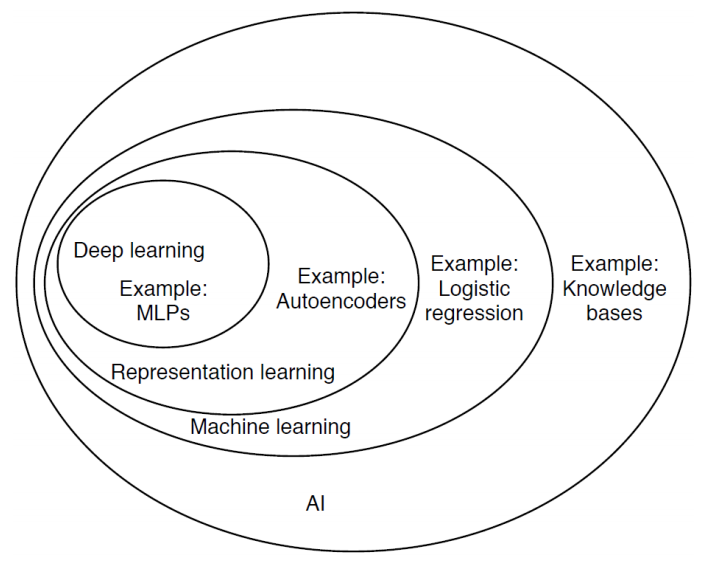
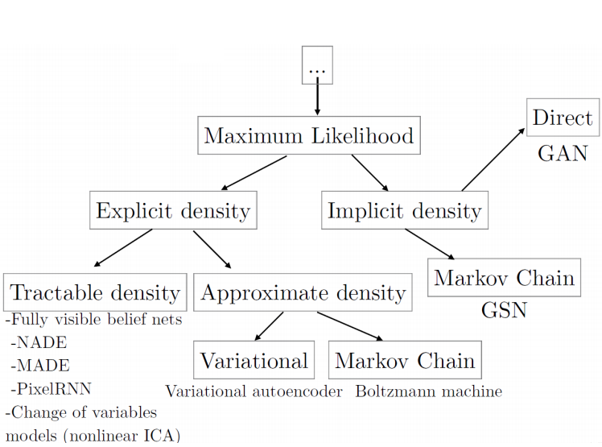
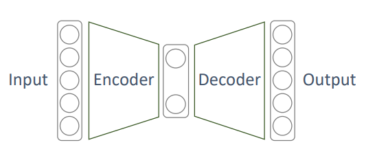
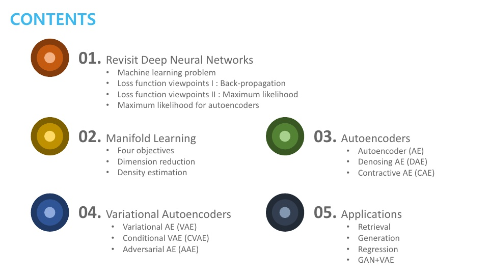

# Introduction
관련 키워드
- Unsupervised Learning
- Representation Learning
- Dimensionality Reduction
- Generative Model Learning

제일 중요한 키워드를 고르면
`Dimensionality Reduction`
- 관련 키워드
    - Nonlinear 
    - Feature Extraction
    - Manifold Learning

벤지오의 기술분류표를 보면 AutoEncder는 Representaition Learning에 속함  
- Representation Learning = Dimensionality Reduction

**GAN**을 만든 이안 굿펠로우의 분류를 보면 Maximum Likelihood와 관련 있음

다시 관련 키워드를 정리해 보면 네 가지로 요약할 수 있음
1. Unsupervised Learning
2. Manifold Learning
3. Generative Model Learning
4. ML Density Estimation

각 키워드는 다음의 과정에서 연관 돼 있음
1. 오토인코더를 학습 할 때
    - 비교사 학습 방법 : Unsupervised Learning
    - Loss를 구할 때 : ML Density Estimation
2. 학습된 오토인코더 
    - 차원 축소 역할 : Manifold Learning
    - 생성 모델 역할 : Generative Model Learning

여기서 **AutoEncoder는** 다음과 같이 정의 할 수 있음
- 입력과 출력이 동일한 구조를 갖는 네트워크
    - 일반적으론 가운데의 차원이 입력 차원보다 작음

강의는 다음과 같이 진행 됨

- ch.01 : Maximun Likelihood가 무엇인가?
- ch.02 : 차원 축소에 사용하는 Manifold Learning가 무엇인가?
- ch.03 : AutoEncoder의 종류
- ch.04 : Variational AutoEncder의 종류
- ch.05 : 실적용